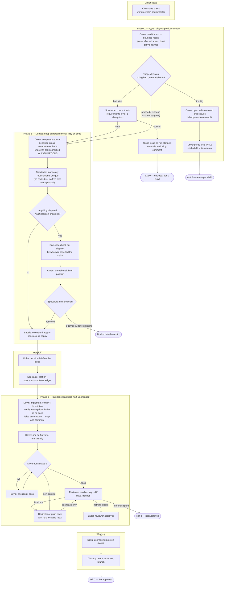

# gdw v4 flow — owen triage + cheap debate + driver-owned build

**Reading keys**

- Reject and split are *successful* exits (0), not failures — a converged decision whose outcome is "don't build this" or "build it in slices."
- Code is opened during the debate only when a claim is **disputed and decision-changing**; everything else rides to the PR as an assumptions ledger and gets verified by devin, who is in those files anyway.
- The driver owns `make ci`; the reviewer reads the log instead of re-running gates.
