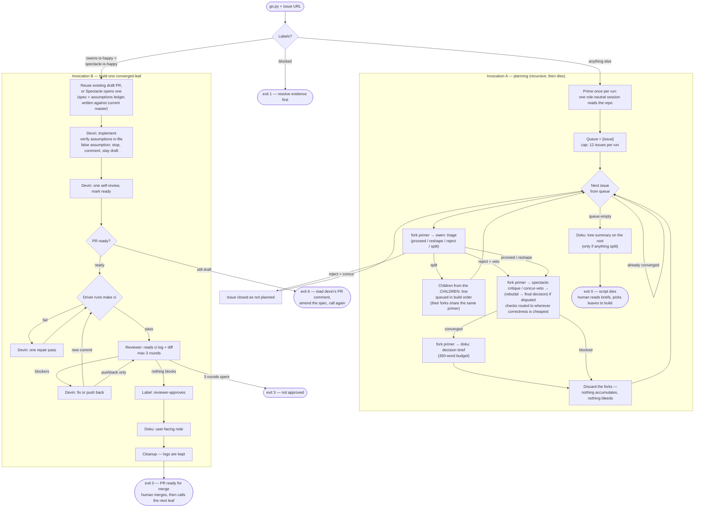

# gdw v5 flow — plan the whole tree with primer forks, then build one leaf per call

This diagram is the specification: [README.md](README.md) tells the
implementing agent how to turn it into `go.py`. Every agent box's prompt is
the matching file in [prompts/](prompts/). The issue's labels are the state:
calling the driver is always safe and always does the right next thing.

**Reading keys**

- **Two invocations by design.** Planning always ends with the script dying after every leaf is briefed — the human reads doku's briefs (and the tree summary on the root) and decides what gets built, while disagreeing is still cheap. Build runs one leaf per call, in the `CHILDREN:` order, with the human merging between calls so each leaf builds on the previous one's merged code.
- **Labels are the state machine.** No verdict → plan. `owens-split` → its children get planned. Converged → build. Blocked → refused until resolved. Re-calling after a crash lands in the right phase automatically; an existing draft PR is reused, never duplicated.
- **The primer.** Planning primes one role-neutral session on the repo, then `orchestrator fork`s it per issue and per role; forks are discarded after their leaf. Repo knowledge is shared through the primer; debate content never is.
- Code is opened during the debate only when a claim is **disputed and decision-changing**, checked by whoever can check cheapest; everything else rides the assumptions ledger to devin, who verifies in the files he is editing anyway. A false assumption stops the build (exit 6) with devin's finding as a PR comment — amend the spec and call again.
- The driver owns `make ci`; the reviewer reads the log instead of re-running gates. Remote (GitHub-hosted) CI is never consulted — local `make ci` is authoritative.
- Run-state vs record: `teams/` content dies with each issue's processing (fresh team + worktree per issue, stale ones reset); `logs/issue-N/<timestamp>/` is permanent.
- Exit codes: 0 phase completed (planning done / rejected / PR approved) · 1 blocked or unconverged · 2 no PR · 3 not approved in 3 rounds · 4 dirty checkout · 5 worktree/branch failure · 6 draft after self-review (false assumption) · 7 CI unfixable · 8 devin didn't commit/push · 9 tree too big or unparseable split.
